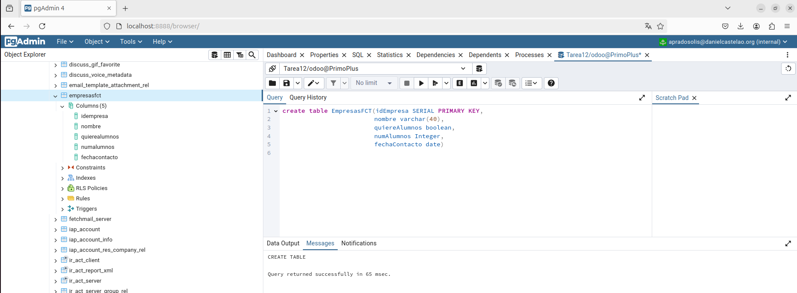

# Tarea12_Odoo


## Apartado 1

``
create table EmpresasFCT(idEmpresa SERIAL PRIMARY KEY, 
						 nombre varchar(40), 
						 quiereAlumnos boolean, 
						 numAlumnos Integer,
						 fechaContacto date)
``       





## Apartado 2

```
insert into EmpresasFCT(nombre,quiereAlumnos,numAlumnos,fechaContacto) values
('TrombonL',True,3,'2025/05/02'),
('LaCobra',True,2,'2025/05/01'),
('Alesas',False,0,'2025/05/01'),
('Leyendap',True,2,'2025/05/03'),
('SanMun',True,1,'2025/05/06')
```

