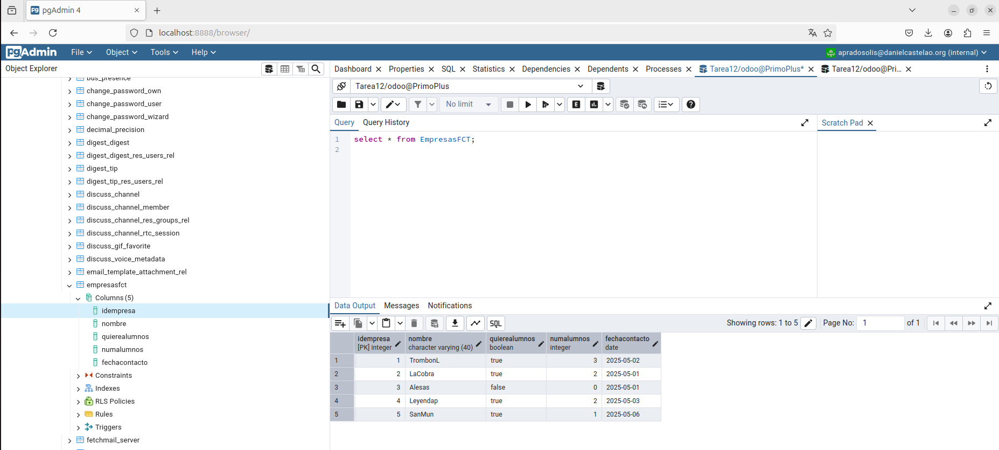
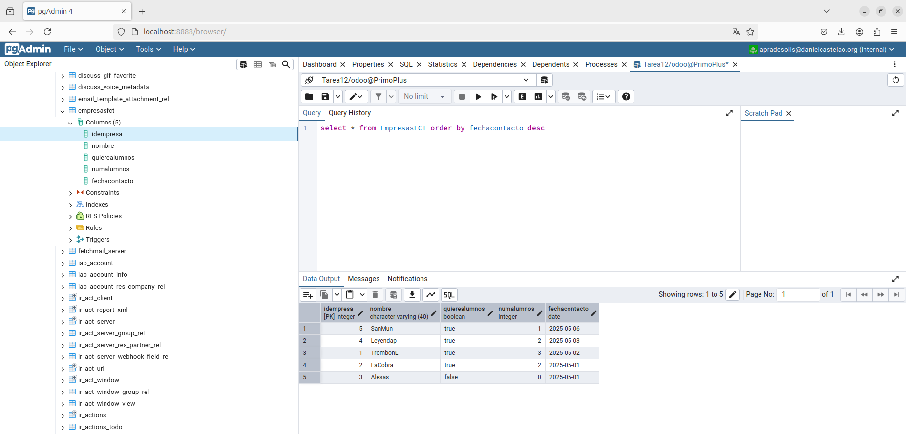
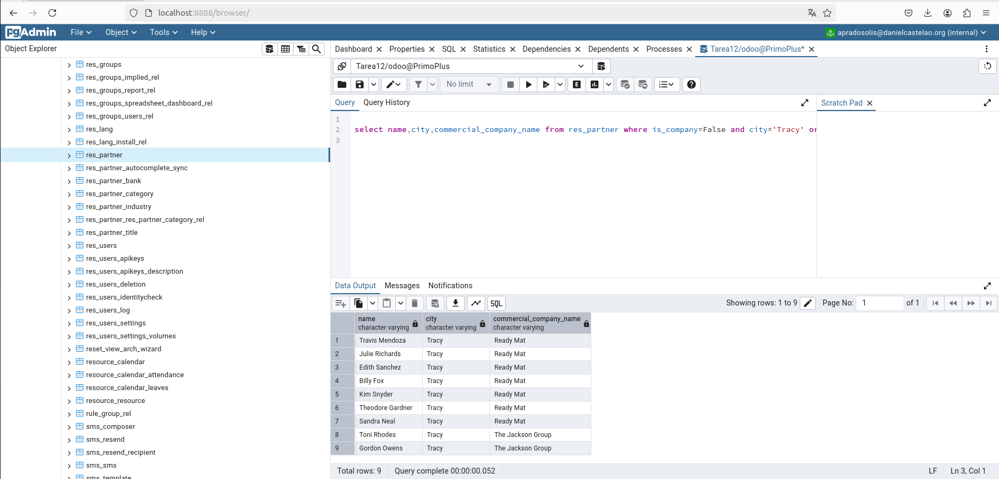
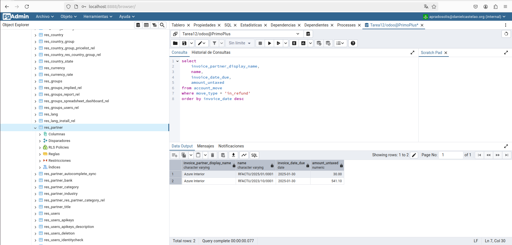

# Tarea12_Odoo


## Apartado 1

``
create table EmpresasFCT(idEmpresa SERIAL PRIMARY KEY, 
						 nombre varchar(40), 
						 quiereAlumnos boolean, 
						 numAlumnos Integer,
						 fechaContacto date)
``       


## Apartado 2

```
insert into EmpresasFCT(nombre,quiereAlumnos,numAlumnos,fechaContacto) values
('TrombonL',True,3,'2025/05/02'),
('LaCobra',True,2,'2025/05/01'),
('Alesas',False,0,'2025/05/01'),
('Leyendap',True,2,'2025/05/03'),
('SanMun',True,1,'2025/05/06')
```



## Apartado 3

```
select * from EmpresasFCT order by fechacontacto desc
```



## Apartado 4

```
select name,city,commercial_company_name from res_partner where is_company=False and city='Tracy' order by commercial_company_name;

```


## Apartado 5


```
select
    invoice_partner_display_name,
    name,
    invoice_date_due,
    amount_untaxed
from account_move
where move_type = 'in_refund'
order by invoice_date desc
```


## Apartado 6


